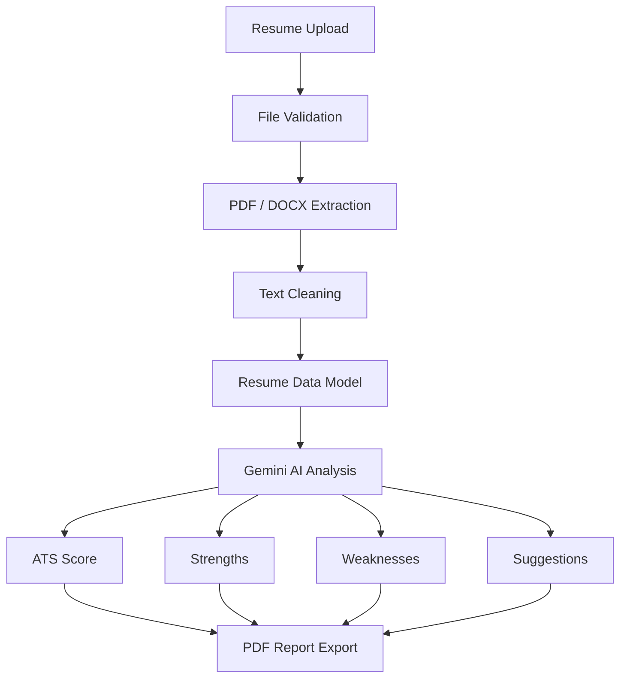

# CareerPilot AI

**An AI-powered career operating system for students** — resume intelligence, project evaluation, personalized roadmaps, and interview prep in one platform.


---

## Overview

CareerPilot AI helps students strengthen their job readiness through AI-driven resume analysis, project evaluation, and personalized career planning. It's built as a structured, sprint-based engineering project rather than a single-file demo — with a modular architecture, test coverage, and clean separation between services, models, and views.

The long-term goal is a single platform where a student can upload a resume, get an honest ATS-style breakdown, track project quality, and generate a roadmap toward a specific role.

---

## Features (Sprint 3)

**Resume ingestion**
- Upload with PDF and DOCX validation
- Text extraction (PyMuPDF, python-docx) and cleaning
- Structured resume data model

**AI analysis**
- Gemini-powered resume analysis
- ATS score generation
- Strength and weakness detection
- Targeted improvement suggestions

**Output & reliability**
- PDF report export
- Structured logging
- User-facing error handling
- Unit test coverage

---

## Architecture



---

## Project Structure

```
CareerPilotAI/
├── assets/
├── components/
├── config/
├── data/
├── database/
├── docs/
├── logs/
├── models/
├── services/
├── tests/
├── utils/
├── views/
├── app.py
├── requirements.txt
└── README.md
```

---

## Tech Stack

| Layer | Technology |
|---|---|
| Frontend | Streamlit |
| Backend | Python |
| AI | Google Gemini API |
| Document processing | PyMuPDF, python-docx |
| Report generation | ReportLab |
| Testing | Pytest |
| Logging | Python `logging` |

---

## Getting Started

**Clone the repository**
```bash
git clone https://github.com/biswajith2005/CareerPilotAI.git
cd CareerPilotAI
```

**Set up a virtual environment**
```bash
python -m venv .venv

# Windows
.venv\Scripts\activate

# macOS / Linux
source .venv/bin/activate
```

**Install dependencies**
```bash
pip install -r requirements.txt
```

**Run the app**
```bash
streamlit run app.py
```

---

## Environment Variables

Create a `.env` file in the project root:

```env
GEMINI_API_KEY=YOUR_GEMINI_API_KEY
GEMINI_MODEL=models/gemini-2.5-flash
```

---

## Running Tests

```bash
pytest
```

---

## Documentation

Detailed docs live in `docs/`:

- Master Plan
- System Architecture
- Sprint Roadmap
- Design System
- Decisions Log
- Project Log
- Prompt Engineering Notes

---

## Roadmap

| Sprint | Focus | Status |
|---|---|---|
| 1 | Project Planning & Architecture | Done |
| 2 | UI Foundation & Modular Architecture | Done |
| 3 | Resume Intelligence Foundation | Done |
| 4 | Authentication & User Management | Planned |
| 5 | Project Intelligence | Planned |
| 6 | Career Roadmap Generator | Planned |
| 7 | Interview Coach | Planned |
| 8 | Career Analytics Dashboard | Planned |
| 9 | AI Decision Engine | Planned |
| 10 | Testing & Optimization | Planned |
| 11 | Deployment | Planned |
| 12 | Documentation | Planned |
| 13 | Final Polish | Planned |

---

## Contributing

Contributions and suggestions are welcome.

1. Fork the repository
2. Create a feature branch
3. Commit your changes
4. Open a pull request

---

## License

Released for educational and portfolio purposes.

---

## Author

**Biswajith Yadav**
Final-year CSE student, Mohan Babu University — building AI-driven developer and career tools.

[GitHub](https://github.com/biswajith2005)